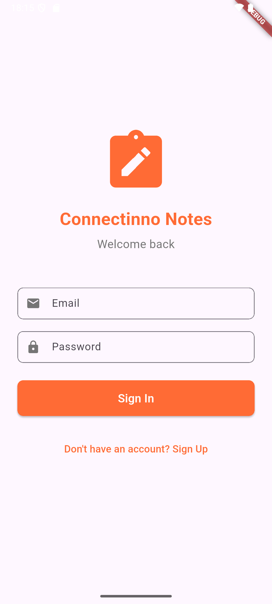
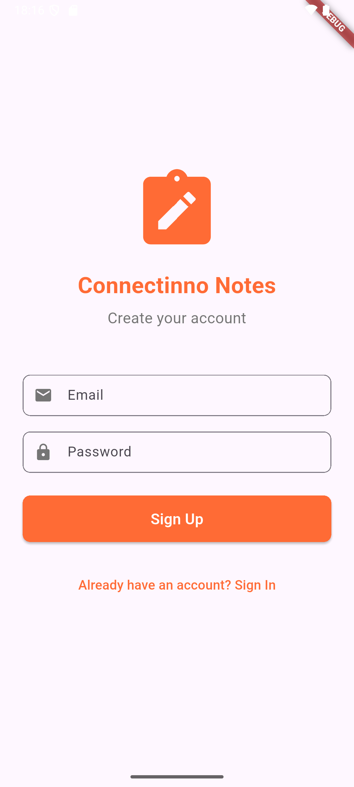
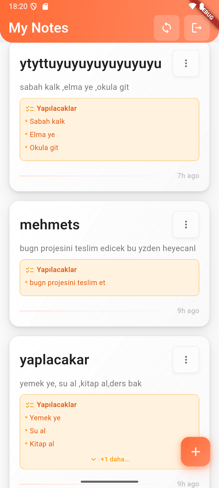
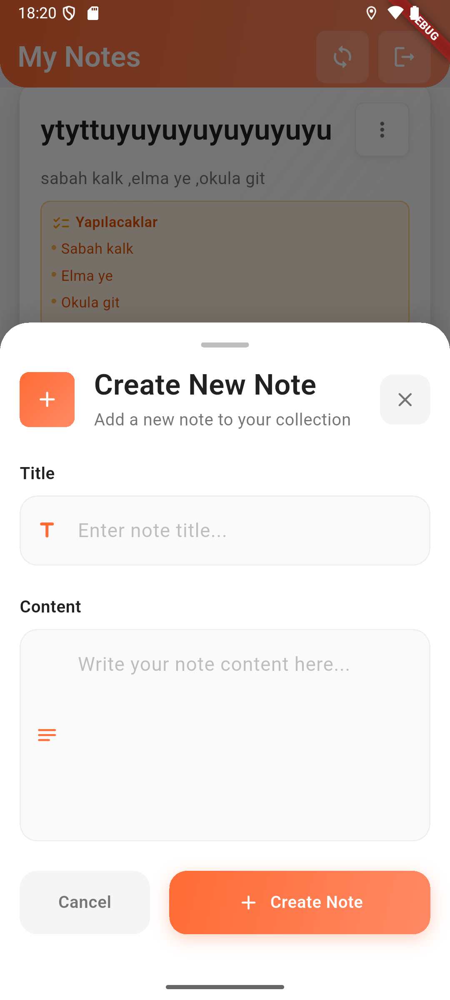
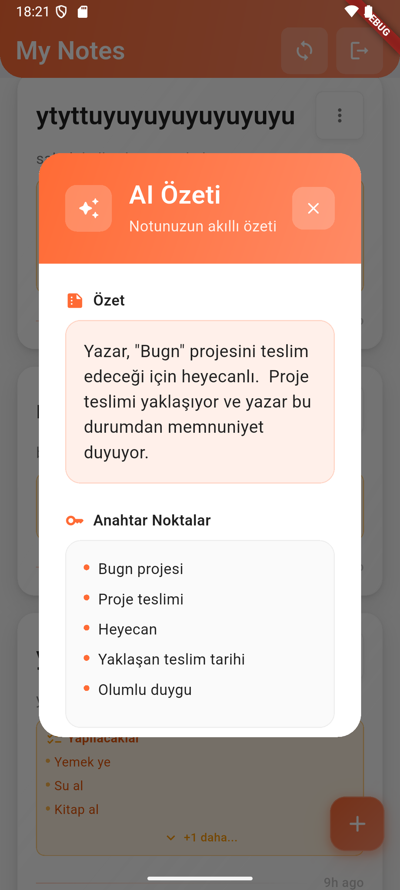

## Application Screenshots
   
<table align="center">
  <tr>
    <td align="center">
      <br/>
      <b>Login Screen</b>
    </td>
    <td align="center">
      <br/>
      <b>Register Screen</b>
    </td>
    <td align="center">
      <br/>
      <b>Home Screen</b>
    </td>
  </tr>
  <tr>
    <td align="center">
      <br/>
      <b>Add Note</b>
    </td>
    <td align="center">
      <br/>
      <b>AI Summary</b>
    </td>
  </tr>
</table>


# Connectinno Notes - Flutter Case Study  - Mehmet Kurt Flutter Dev.


### 🔐 Authentication
- **Login/Logout**: Firebase Auth with email/password authentication
- **Secure Token**: JWT token-based backend communication
- **Session Management**: Automatic token refresh and secure logout

### 📝 CRUD Operations
- **Create Notes**: Create new notes with title and content
- **Read Notes**: List and display user-specific notes
- **Update Notes**: Edit and save existing notes
- **Delete Notes**: Secure note deletion with soft delete

### 🔄 Offline-First Architecture
- **Local Storage**: Fast cache system with Hive
- **Auto Sync**: Automatic synchronization when internet connection is available
- **Pending Operations**: Queue operations performed while offline
- **Conflict Resolution**: Data consistency with last-write-wins strategy

### 🤖 AI-Powered Features
- **Note Summarization**: Automatic content summarization with Google Gemini API
- **Todo Detection**: Automatic extraction of actionable items from note content

### 🏗️ Clean Architecture
- **Layered Structure**: Presentation, Domain, Data layers
- **State Management**: Reactive state management with Cubit
- **Dependency Injection**: Dependency management with Get_it
- **Repository Pattern**: Data access abstraction

## 🛠️ Tech Stack

### Frontend (Flutter)
- **Flutter**: 3.0+ (Cross-platform UI framework)
- **Dart**: 3.0+ (Programming language)
- **flutter_bloc**: State management (Cubit)
- **Hive**: Local database and cache
- **Dio**: HTTP client and API communication
- **Firebase Core & Auth**: Authentication
- **connectivity_plus**: Network status monitoring
- **get_it**: Dependency injection
- **json_serializable**: JSON serialization
- **freezed**: Immutable data classes

### Backend (FastAPI)
- **FastAPI**: Modern Python web framework
- **Python**: 3.8+ (Backend programming language)
- **Firebase Admin SDK**: Token verification and Firestore access
- **Google Cloud Firestore**: NoSQL database
- **Pydantic**: Data validation and serialization
- **Uvicorn**: ASGI server
- **Google Gemini API**: AI features

### Database & Storage
- **Firebase Firestore**: Cloud NoSQL database
- **Hive**: Local NoSQL database for Flutter
- **Firebase Auth**: User authentication service

### AI & Machine Learning
- **Google Gemini API**: Note summarization and todo detection
- **Natural Language Processing**: Content analysis and processing

## 📱 Setup Instructions

### Prerequisites
- Flutter SDK (3.0+)
- Dart SDK (3.0+)
- Python 3.8+
- Firebase project setup
- Google Gemini API key

### Environment Configuration

1. **Backend Setup**:
```bash
cd connectinno_backend
python -m venv .venv
source .venv/bin/activate  # Windows: .venv\Scripts\activate
pip install -r requirements.txt
uvicorn app.main:app --reload --port 8000
```

2. **Frontend Setup**:
```bash
flutter pub get
flutter run
```

3. **Firebase Configuration**:
- Add `google-services.json` file to `android/app/` folder
- Enable Authentication and Firestore in Firebase project

## 🏗️ Architecture

The project follows Clean Architecture principles:

### Presentation Layer (UI Layer)
- **Widgets**: User interface components
- **Cubit**: State management and business logic
- **Pages**: Screen structures and navigation

### Domain Layer (Business Logic Layer)
- **Entities**: Core business objects
- **Use Cases**: Business rules and scenarios
- **Repository Interfaces**: Data access abstractions

### Data Layer (Data Layer)
- **Repository Implementations**: Data access implementations
- **Data Sources**: Remote and local data sources
- **Models**: Data transfer objects

## 📊 Offline-First Strategy

### Cache-First Approach
- **Hive Cache**: Local storage of notes
- **Instant Loading**: Fast data access from cache
- **Background Sync**: Updates without blocking UI

### Synchronization Algorithm
1. **Local Cache Check**: Local data is checked first
2. **Remote Sync**: Update from remote server if internet is available
3. **Conflict Resolution**: Last-write-wins strategy
4. **Pending Operations**: Queue offline operations

## 🤖 AI Features Details

### Note Summarization
- **Google Gemini API** integration
- **Content Analysis**: Extract meaningful summary from note content
- **Key Points**: Highlight important information
- **Word Count**: Compare original and summary word counts

### Todo Detection
- **Automatic Detection**: Extract actionable items from note content
- **Smart Filtering**: Filter out irrelevant content
- **Structured Output**: Result in todo list format
- **Real-time**: Automatic todo detection when creating notes

## 🔄 Data Flow

### Note Creation
1. **UI Input** → Cubit → Repository
2. **Local Save** → Save to Hive cache
3. **Remote Sync** → Send to backend
4. **AI Processing** → Todo detection (optional)
5. **Cache Update** → Save updated data to cache

### Note Synchronization
1. **Connectivity Check** → Check internet status
2. **Background Sync** → Background data synchronization
3. **Conflict Resolution** → Resolve conflicting data
4. **UI Update** → Update user interface

## 🚀 Future Enhancements

### AI-Powered Features
- **Smart Note Categorization**: Automatic tagging and categorization of notes using AI
- **Content Suggestions**: AI-powered writing suggestions and auto-completion
- **Voice-to-Text Integration**: Speech recognition for hands-free note creation
- **Image Recognition**: Extract text from images and convert to notes
